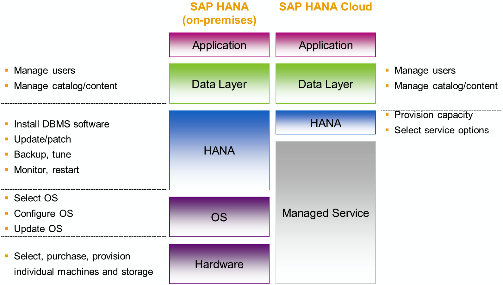
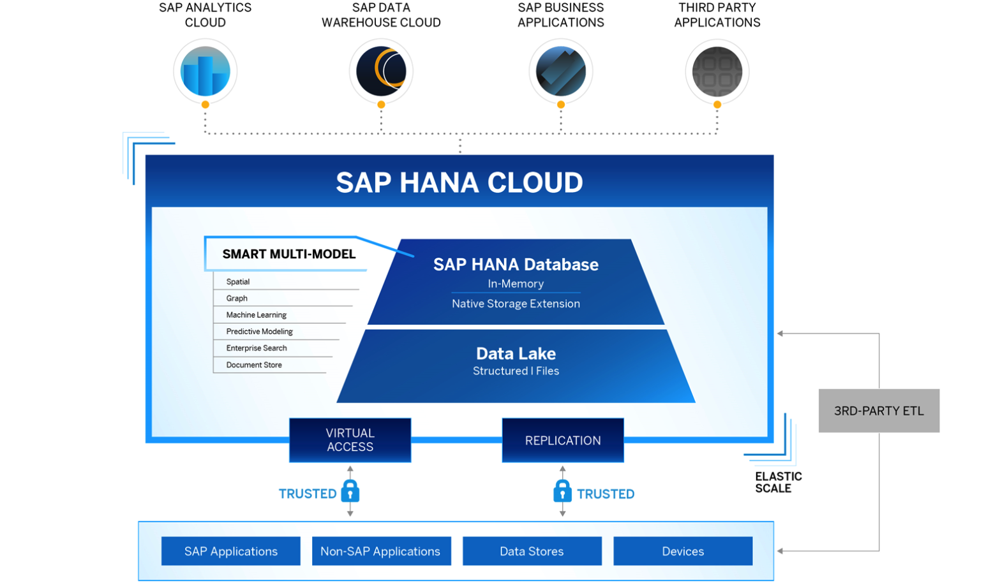

#   Concepts

##  SAP HANA Cloud Value Proposition

- multi-service DB
- data on demand
- easy integration
- power of the cloud
- streamlined access
- developer experience

##  SAP HANA Cloud x SAP HANA

##  SAP HANA Cloud Architecture

- SAP HANA Cloud fornece dados para SAP SAP, SAP Datasphere, SAP Business Applications e aplicações de terceiros;
- OLTP e OLAP (Online Transaction Processing e Online Analytical Processing): o primeiro é transacional, o segundo é analítico, com isso, já se pode supor a característica de cada um;
- Pode ser executado em: Azure, AWS, GCP, Alibaba Cloud e SAP;
- SAP HANA Cloud é executado encima de uma arquitetura Kubernetes;

##  Interface

- SAP HANA Cloud é composto por:
  - Central: tela principal do DBaaS. Por aqui podemos monitorar os recursos do serviço através de indicadores analíticos;
  - SAP HANA Cockpit: Aqui acessamos o banco de dados HANA Cloud;
  - SAP HANA Explorer: Aqui podemos executar comandos SQL e atualizar dados e estruturas do nosso banco;